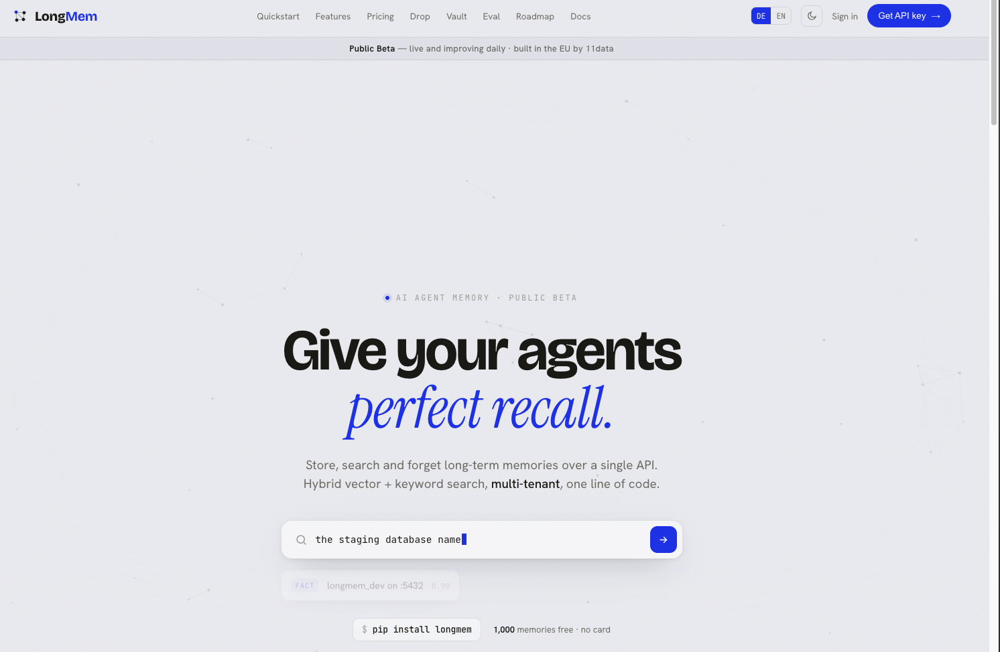
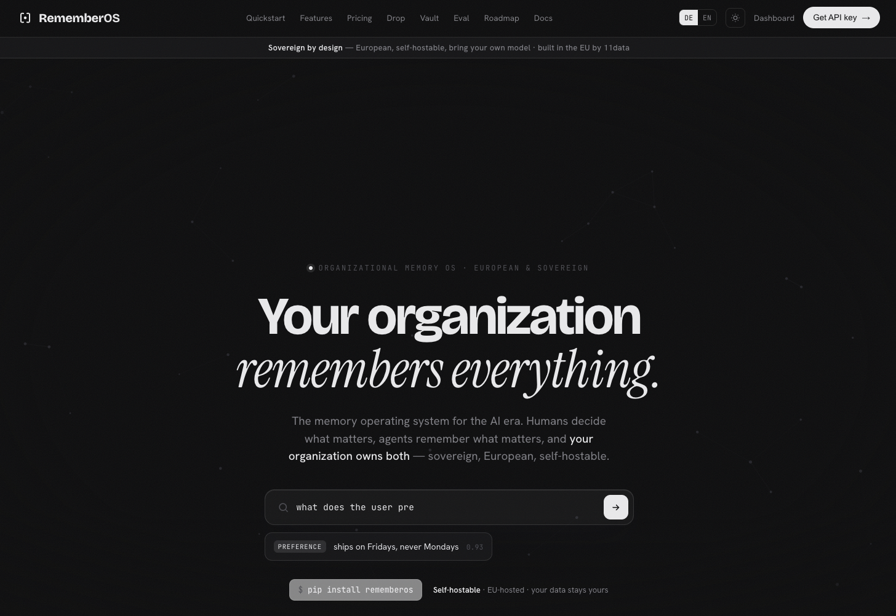
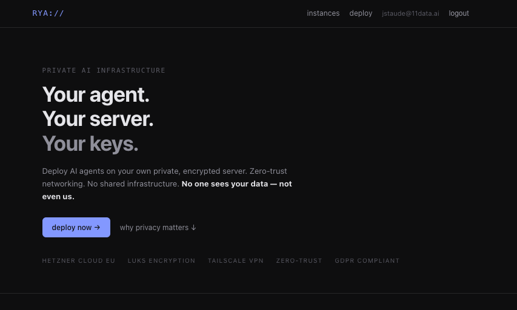
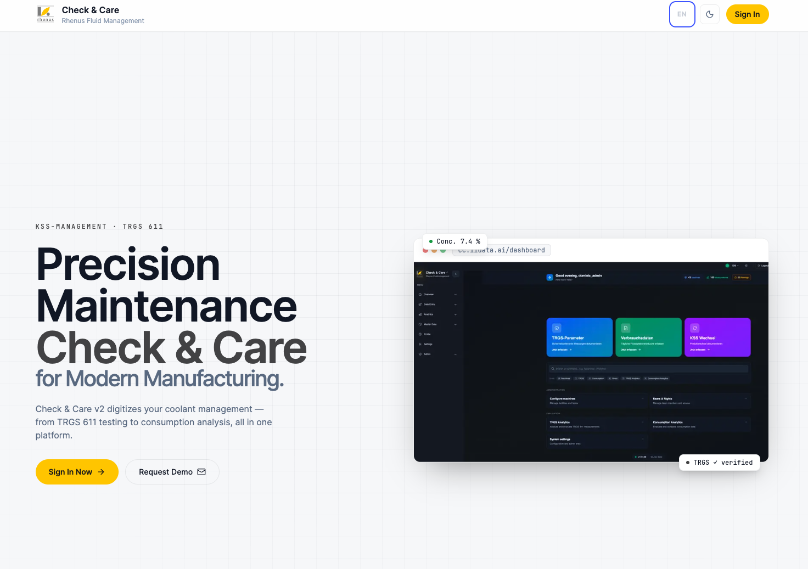
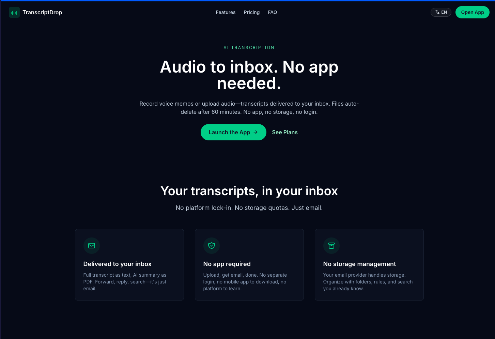

## Jonathan Staude

I build AI agents and the infrastructure they run on — founder of **[11data](https://11data.ai)**.

My focus is the unglamorous layer that makes agents actually useful in production: durable
memory, a documentation-first way of working, and the tooling around the loop. I care more
about systems that stay reliable over months than demos that look good for an afternoon.

*Concepts were always the easy part. Building them wasn't — so I built the infrastructure to close that gap.*

---

### Products

<table>
  <tr>
    <td width="50%" valign="top">
      <a href="https://longmem.dev"><strong>LongMem</strong></a> — AI agent memory &nbsp;·&nbsp; <em>Public Beta</em> 
      Give your agents perfect recall. Store, recall, and search long-term memories over a single API. Hybrid vector + keyword search, multi-tenant, MCP-native.  
      
    </td>
    <td width="50%" valign="top">
      <a href="https://rememberos.ai"><strong>RememberOS</strong></a> — Organizational memory OS 
      Your organization remembers everything. Humans decide what matters, agents remember it — sovereign, European, self-hostable. Built in the EU by 11data.  
      
    </td>
  </tr>
  <tr>
    <td width="50%" valign="top">
      <a href="https://runyouragent.com"><strong>RunYourAgent</strong></a> — Private AI infrastructure 
      Deploy AI agents on your own dedicated, encrypted EU server. Zero-trust networking via Tailscale, LUKS encryption, BYOK. No shared infrastructure, no data access — not even ours.  
      
    </td>
    <td width="50%" valign="top"></td>
  </tr>
  <tr>
    <td width="50%" valign="top">
      <a href="https://cc.11data.ai"><strong>Check & Care</strong></a> — Precision maintenance 
      Digitizes coolant management for Rhenus Fluid Management — TRGS 611 testing, consumption analytics, KSS management, all in one platform.  
      
    </td>
    <td width="50%" valign="top">
      <a href="https://transcriptdrop.com"><strong>TranscriptDrop</strong></a> — Audio to inbox 
      Record voice memos or upload audio — transcripts delivered to your inbox as text + AI summary PDF. Files auto-delete after 60 minutes. No app, no login, no storage.  
      
    </td>
  </tr>
</table>

---

### Platform & methodology

**[Mira](https://github.com/11data/mira)** — voice-first agent platform.  
Mobile PWA and Telegram in one shared session, with a natural-conversation Pipecat voice
pipeline, modular agent routing, and LongMem-backed memory. Self-building: a harness loop
drives the agent autonomously and gets more reliable the more it runs.

**[docs-driven-agents](https://github.com/jonameron/docs-driven-agents)** — the methodology.  
Documentation as the primary source of truth; reusable procedures as skills; a self-build loop
that turns a coding agent into an autonomous developer. Less vibe-coding, more engineering.

---

### Background

I've been building community-driven, decentralized systems since well before it was a
category — back in 2018 I led
[protchain](https://github.com/jonameron/MK-Protection), a decentralized cellphone-insurance
concept presented at D1Conf in Prague. The throughline from then to now: take a process
everyone assumes needs a central operator, and figure out how to make it work without one.

From decentralized fintech infrastructure to AI agents — the question is always the same:
what's the minimal trust you actually need, and what can you make reliable without it?

I also bring on student interns and put their work out in the open —
[11data_agent_research](https://github.com/jonameron/11data_agent_research).

---

### Stack

`Python` · `TypeScript / Next.js` · `PostgreSQL` · `FastAPI` · `Pipecat`  
Cloudflare · self-hosted infra (Tailscale, systemd)

---

### Elsewhere

[11data.ai](https://11data.ai) · [longmem.dev](https://longmem.dev) · jstaude@11data.de
